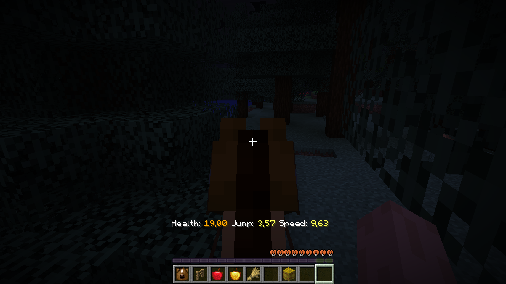
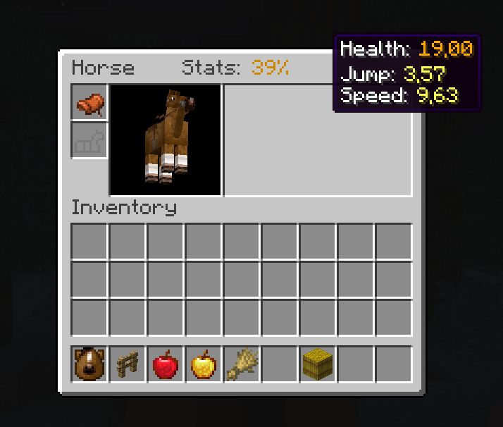
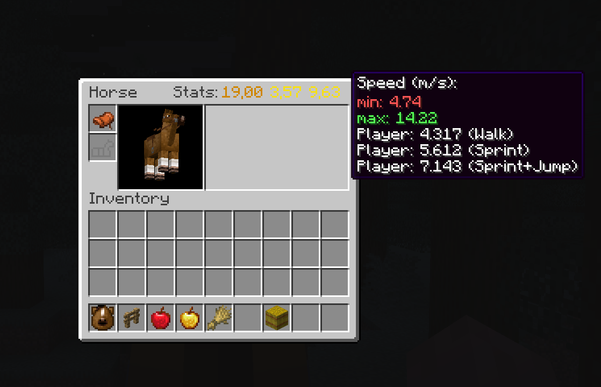
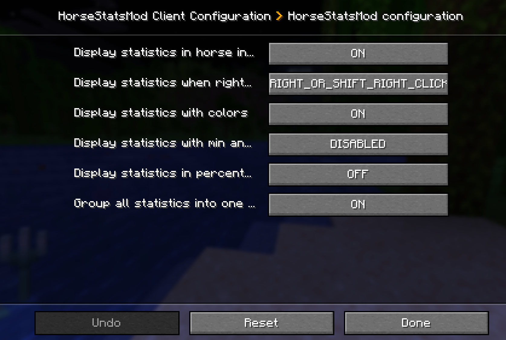
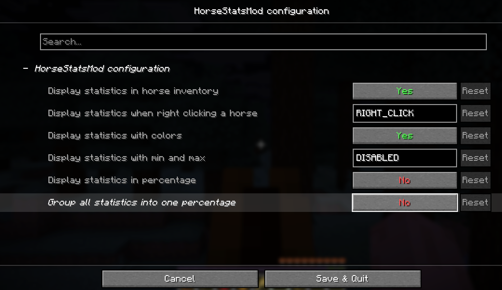

# [Horse Stats Mod](https://github.com/lilgallon/HorseStatsMod)

**Horse Stats Mod** is a lightweight and essential tool for Minecraft breeders. It allows you to instantly visualize the precise capabilities of your mounts (speed, jump height, health) without any guesswork.

---

## ✨ Features

Display detailed statistics for **Horses, Donkeys, Mules, and Llamas**:

* **HUD Display:** View stats instantly while riding via the action bar.
* **Inventory Integration:** See precise values directly inside the horse's inventory screen.
* **Min/Max Comparison:** Compare your mount's stats against the game's theoretical limits.
* **Color-Coded Feedback:** Quickly identify high-quality stats (Green) versus poor ones (Red).
* **Percentage Mode:** Display a global "quality score" (0-100%) to easily rank your stable.
* **Multi-Loader Support:** Fully compatible with both **Fabric** and **NeoForge**.

---

## 📸 Screenshots

|                 Live HUD Stats                  | Grouped Inventory Stats |                           Detailed Min/Max View                           |
|:-----------------------------------------------:| :---: |:-------------------------------------------------------------------------:|
|  |  |  |
|        *Real-time stats while mounting*         | *Global score and quick overview* |                  *Detailed comparison with player speed*                  |

---

## ⚙️ Configuration

The mod is highly customizable. You can toggle features via the **Mod Menu** (Fabric) or the **Config Screen** (NeoForge) to fit your playstyle.

**Customizable options include:**
* Toggle display in the horse inventory.
* Change interaction triggers (Right-click vs Shift+Right-click).
* Enable/Disable color indicators and percentage calculations.
* Show/Hide Min/Max reference values.

|                      NeoForge Config                      |                     Fabric Config                     |
|:---------------------------------------------------------:|:-----------------------------------------------------:|
|  |  |

---

## 🤝 Contributing

Contributions are always welcome! Whether it's fixing a typo, adding a translation, or proposing a new feature:
* Don't hesitate to open a **Pull Request**.
* Please ensure your commits are clear and descriptive.
* Even small changes make a big difference! :)

## 📜 Credits & Acknowledgements

- **[@lilgallon](https://github.com/lilgallon)** - *Main Developer*
